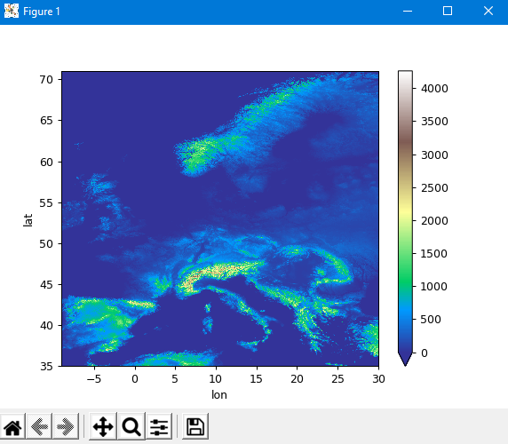
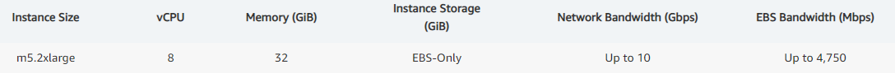

# Big_Data_Processing
Project concerning data analysis of data containing information about differentiation of the altitude of the terrain (Europe) and data grouping (designate 6 groups) based on increase in altitude measured on the basis of atleast 10 points. The main purpose of the project was to compare performance between single local stations and clusters during big data processing.

### [ENG]
##### Project goals
The purpose of the task was to find areas in Europe with the greatest growth based on
minimum 10 measuring points. The results achieved were to be visualized.

##### Technologies used
Python 3.7 - a high-level programming language with an extensive library package. Thanks to its
transparent syntax it allows you to create advanced, but most of all readable source codes.

PODPAC - a Python library based on the SciPy ecosystem (Python, Numpy, SciPy, Matplotlib),
intended for simple and reproducible geospatial analytics that work locally or in the cloud.

Amazon EC2 - a web service that provides scalable computing power on demand in the AWS cloud.
It allows you to select instances with the desired parameters and perform calculations that require them,
which would be much more time consuming using the user's local power computing.

We decided to use such combination, due to the best knowledge of the programming language,
which is Python and the possibilities that comes with its extensive libraries. One of them is
precisely the PODPAC library, which we used for two most important reasons. First, it simplifies
the process of downloading geographic data from the AWS cloud to a minimum, which allows us to focus mainly
on the processing of received data. Secondly, it is an integral part of the already used in this project
language, which allowed us to stay 100% Python. During the implementation of the project, we wondered
on the possibility of using the Lambda PODPAC function in the AWS cloud, although we finally decided on
the use of Amazon EC2. This decision was made largely on the basis of the range of possibilities offered
through this service (freedom in choosing the computing power on demand, ease of configuration and just like the name itself
indicates the flexibility of this solution).

##### Implementation

The project implementation was based on the following steps:
1. Visualization the map of Europe.
2. Calculation of groups of areas consisting of 100 measurement points [10x10].
3. Count the average height height of each group.
4. Visualization of the height difference of groups of areas lying in Europe in the form of * .svg graphics.
5. Converting the obtained area data to a * .csv file.

Effects of limiting the Terrain Tiles dataset from Mapzen, containing the map of the whole world, to Europe
are shown in the figure below. Everything was made in Python and for the continent's visualization the PODPAC 
library was used due to its support for the used dataset and hence the ease of obtaining the tested data.

After pre-processing the data containing information about the height of the terrain and selecting proper areas,
it was time to determine  with NumPy the average height in each group. The speed of task execution in the local
environment was compared with using the resources of Amazon Web Services. Naturally, with the use of AWS, 
the program worked a lotfaster, thanks to much more computing power available with EC2. Additionally,
the data needed for performing calculations (in the case of using EC2) did not even leave the cloud, so the code made in
the cloud only returned the effects. 

The measured time of the data processing are shown in the table below.

|  Local environment  |  Use of AWS   |
| -------------------- | -------------------- |
| ~50 min with zoom = 8 |  ~3 min with zoom = 8 |
|     i5 processor      |        8 vCPU        |

As we can see, the difference is impressive, and it is worth mentioning that it was achieved using an instance only about 
the size of m5.2xlarge (you can also choose instances much more powerful such as m5.24xlarge with 96 CPUs).

M5 instances feature either the 1st or 2nd generation Intel Xeon Platinum 8000 series processor (Skylake-SP or Cascade Lake) with a sustained all core Turbo CPU clock speed of up to 3.1 GHz.

##### Amazon Web Services
The AWS Elastic Computing service was used to launch the program. Access to EC2 is provided via PUTTY program. The use of 
cloud computing has significantly accelerated the data processing process, as can be seen from the previous table.

##### Results achieved
The final result of the program is a * .csv file, which contains the height data with division on measurement groups. 
A * .svg file is also saved, containing a map visualization taking into account the height increase in various areas of Europe.

### [PL]
### Raport z zadania projektowego nr 1

##### Cele projektu

Celem zadania było znalezienie grup obszarów w Europie o największym wzroście na podstawie 
minimum 10 punktów pomiarowych. Osiągnięte wyniki miały zostać zwizualizowane.

##### Wykorzystane technologie 
Python 3.7 - język programowania wysokiego poziomu o rozbudowanym pakiecie bibliotek. Dzięki swojej
przejrzystej składni umożliwia tworzenie zaawansowanych, ale przede wszystkim czytelnych kodów źródłowych.

PODPAC - to biblioteka Pythona, opierająca się na ekosystemie SciPy (Python, Numpy, SciPy, Matplotlib), 
aby umożliwić proste oraz odtwarzalne analizy geoprzestrzenne, które działają lokalnie lub w chmurze.

Amazon EC2 - to usługa internetowa zapewniająca skalowalną moc obliczeniową na żądanie w chmurze AWS.
Pozwala na wybór instancji o pożądanych przez nas parametrach i wykonywanie na nich wymagających obliczeń,
które byłyby o wiele bardziej czasochłonne z wykorzystaniem posiadanej przez użytkownika lokalnie mocy 
obliczeniowej.

Zdecydowaliśmy się na właśnie takie połączenie, z racji na największą styczność z językiem programowania,
jakim jest Python oraz możliwości które niosą za sobą jego rozbudowane biblioteki. Jedną z nich jest
właśnie biblioteka PODPAC, z której skorzystaliśmy z dwóch najistotniejszych powodów. Po pierwsze upraszcza
do minimum proces pobierania danych geograficznych z chmury AWS co pozwala nam skupić się w głównej mierze 
na przetwarzaniu otrzymanych danych. Po drugie jest integralną częścią wykorzystywanego przez nas w projekcie 
języka, co umożliwiło nam pozostanie w 100% przy Pythonie. W trakcie realizacji projektu zastanawialiśmy się 
nad możliwością wykorzystania funkcji Lambda PODPAC w chmurze AWS, aczkolwiek finalnie zdecydowaliśmy się na
wykorzystanie Amazon EC2. Decyzja ta zapadła w głównej mierze biorąc pod uwagę szereg możliwości oferowanych
przez tą usługę (dowolność w wyborze mocy obliczeniowej na żądanie, łatwość konfiguracji oraz jak sama nazwa
wskazuje elastyczność tego rozwiązania)

##### Realizacja

Wykonanie projektu opierało się o następujące kroki:
1. Wizualizacja obszaru Europy.
2. Wyznaczenie grup obszarów składających się ze 100 punktów pomiarowych [10x10].
3. Policzenie średniego wzrostu wysokości każdej grupy.
4. Wizualizacja różnicy wysokości grup obszarów leżących w Europie w postaci grafiki *.svg.
5. Konwersja uzyskanych danych o obszarach do pliku *.csv.

Efekty ograniczenia obszaru datasetu Terrain Tiles od Mapzen, zawierającego mapę całego świata, do Europy
przedstawione zostały na rysunku poniżej. Całość wykonana została w języku Python, a do zwizualizowania 
rozważanego kontynentu wykorzystano bibliotekę PODPAC ze względu na jej wsparcie dla używanego datasetu, 
a co za tym idzie łatwość pozyskiwania badanych danych.

Po wstępnym przetworzeniu danych zawierających informacje o wysokości terenu na rozważanym kontynencie 
i wydzieleniu odpowiednich grup obszarów przystąpiono do wyznaczenia w każdej grupie średniego wzrostu 
wysokości za pomocą biblioteki NumPy. Dokonano porównania szybkości realizacji zadania w lokalnym środowisku
oraz przy wykorzystaniu zasobów Amazon Web Services. Naturalnie przy pomocy AWS program działał znacznie 
szybciej, za sprawą dużo większej mocy obliczeniowej dostępnej dzięki EC2. Dodatkowo, dane potrzebne do 
wykonania obliczeń (w przypadku wykorzystania EC2) nawet nie opuszczały chmury, więc kod wykonany w 
chmurze zwracał nam tylko i wyłącznie efekty.

Zmierzone czasy przetwarzania danych przedstawione są w poniższej tabeli.

|  Lokalne środowisko  |  Wykorzystanie AWS   |
| -------------------- | -------------------- |
| ~50 min dla zoom = 8 |  ~3 min dla zoom = 8 |
|     Procesor i5      |        8 vCPU        |

Jak widać różnica robi wrażenie, a warto nadmienić, iż osiągnięta została przy wykorzystaniu instancji 
zaledwie o rozmiarze m5.2xlarge, (możliwe do wyboru były również instancje kilka-kilkanaście razy mocniejsze
takie jak m5.24xlarge posiadające 96 procesorów).

Instancje M5 wyposażone są w procesory Intel Xeon Platinum 8000 pierwszej lub drugiej generacji (Skylake-SP 
lub Cascade Lake) ze stałą szybkością taktowania wszystkich rdzeni Turbo CPU do 3,1 GHz.

##### Amazon Web Services
Do uruchomienia programu posłużono się serwisem AWS Elastic Computing. Dostęp do EC2 realizowany jest poprzez 
program PUTTY. Wykorzystanie chmury obliczeniowej znacznie przyspieszyło proces przetwarzania danych, co widać 
z poprzedniej tabeli.

##### Osiągniete wyniki

Efektem końcowym działania programu jest plik *.csv, w którym znajdują się dane dotyczące wysokości z podziałem 
na grupy pomiarowe. Zapisywany jest również plik *.svg zawierający wizualizację mapy uwzględniającej wzrost wysokości 
w różnych obszarach Europy.

